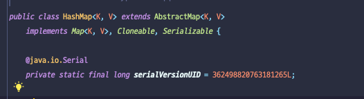
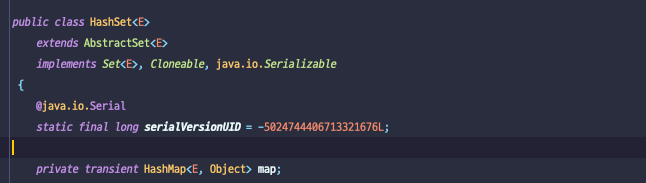

# HashMap과 HashSet

---
## HashMap

HashMap은 `Map 인터페이스의 구현체`로 Key-Value 구조를 가지고 있다.
해싱을 사용하기에 키를 통한 캐싱, 인덱싱 및 데이터 저장에 자주 사용한다.

HashMap은 키와 값을 Object 타입으로 저장하기에 어떠한 객체로 저장할 수 있지만, 주로 String 대소문자를 통일해 사용하곤한다.

컬렉션 내의 키(key) 중에서 유일해야 하므로 중복을 허용하지 않는다.
그러나 값(Value)는 중복을 허용한다.

HashMap은 저장공간보다 값이 추가로 들어오면 List처럼 저장공간을 추가로 늘리는데 List처럼 저장공간을 한 칸씩 늘리지 않고 약 두 배로 늘린다.
그렇게 때문에, 과부하가 많이 발생할수도 있고 초기에 저장할 데이터 개수를 알고 있다면 Map의 초기 용량을 지정해주는 것도 좋은 방법이다.

#### 대표적인 HashMap 몇가지 메서드
| 메서드 | 반환 타입 | 설명 |
| --- | --- | --- |
| clear() | void | HashMap에 저장된 모든 객체를 제거한다.|
| containsKey(Object Key) | boolean | HashMap에 지정된 키가 포함되어있는 지 확인 |
| containsValue(Object Value) | boolean | HashMap에 지정된 값이 포함되어있는 지 확인 |
| entrySet() | Set | HashMap에 저장된 키와 값을 엔트리의 형태로 Set에 저장한다. |
| get | Object | 지정된 Key의 Value를 반환, 없으면 null |
| isEmpty | boolean | HashMap이 비어있는지 확인 |
| put (Object key, Object value) | Object | 지정된 키와 값을 HashMap에 저장 |
| remove(Object key) | Object | HashMap에서 지정된 키로 저장된 값(value)를 제거 |
| size() | int | HashMap에 저장된 요소의 개수를 반환 |
| values() | Collection | HashMap에 저장된 모든 값을 컬렉션의 형태로 반환. |

---
## HashSet

HashSet은 `Set 인터페이스의 구현체`로 컬렉션이자 중복된 요소를 저장하지 않는다.
그렇기에 HashSet에 이미 저장되어 있는 요소를 추가하고자 하면

1. 객체를 저장하기 전, 먼저 객체의 hashCode() 메서드를 호출해서 해시 코드를 얻어낸다.
2. 저장되어 있는 객체들의 해시 코드와 비교한다
3. 만약 같은 해시 코드가 있다면, equals 메서드로 두 객체의 동등성 비교로 true가 나올 시 중복을 허용하지 않는다.

ArrayList와 달리 저장순서가 없기에 저장순서를 갖고자 하면 LinkedHashSet를 사용한다.

#### 대표적인 HashSet 몇가지 메서드

| 메서드 | 반환 타입 | 설명 |
| --- | --- | --- |
| add(Object o) | boolean | 새로운 객체를 저장 |
| addAll(Collection c)| boolean | 주어진 컬렉션에 저장된 모든 객체를 추가 |
| clear() |void | 저장된 모든 객체를 삭제 |
| contains(Object o) | boolean | 지정된 객체를 포함하는지 확인 |
|isEmpty() | boolean | HashSet이 비어있는지 확인 |
| remove(Object o) | boolean | 지정된 객체를 HashSet에서 삭제
| retainAll(Collection c) | boolean | 주어진 컬렉션에 저장된 객체와 동일한 것만 남기고 삭제 (교집합) |
| size() | int |저장된 객체의 개수 반환 |
| toArray() | Object[] |저장된 객체들을 객체배열의 형태로 반환 |
| toArray(Object[] a) | Object[] |저장된 객체들을 주어진 객체배열(a)에 담는다. |

---
## HashMap vs HashSet

| 특징 | HashSet | HashMap |
| --- | --- | --- |
| 구현 | Set의 구현체 | Map의 구현체 |
| 중복허용 여부 | 객체 자체를 데이터로 저장하기 때문에 중복 X | key는 중복을 허용 X, value는 중복을 허용 |
| 데이터 저장 | 객체(Object)만 저장할 수 있다. 내부적으로 HashMap을 사용하기 때문에 삽입되는 객체(Key 값)와 dummy 객체(Value 값), 삽입 연산 동안 총 두 개의 객체가 생성 | 데이터를 key-value 쌍 형식으로 저장. 삽입 연산 동안 단 하나의 객체가 생성 |
| Dummy values | O | X |
| 속도 비교 | HashMap보다 느리다. | HashSet보다 빠르다. |
| 추가 메서드 | add() | put() |
| Null | 단 하나의 NULL 값을 가질 수 있다. | 단 하나의 NULL 값을 Key 값으로 가질 수 있고, 여러 NULL 값을 Value 값으로 가질 수 있다. |

