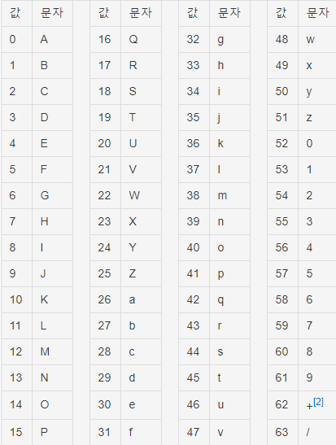
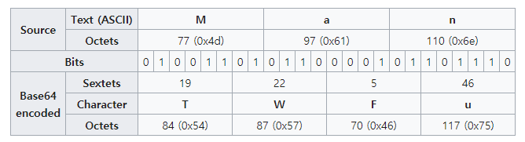

# Base64란?

먼저 base64에 대해 알기 전, 인코딩과 디코딩의 의미부터 알아야 한다.

인코딩(encoding)은 파일에 저장된 정보의 형태나 형식을 데이터 표준화, 보안, 처리 속도 향상, 저장 공간 절약 등을 위해 다른 형태로 변환하는 처리 혹은 그 처리 방식을 말한다. 이메일 등의 전송, 동영상과 이미지 영역에서 많이 사용되며, 인코딩의 반대말은 디코딩(decoding)이다.

Base64는 말 그대로 64진법이라는 의미이다. 컴퓨터 분야에서 쓰이는 base64는 실행 파일이나 압축 파일 같은 8비트 이진 데이터를 문자 코드에 영향받지 않는 공통 ASCII 영역의 문자들로만 이루어진 문자열로 바꾸는 인코딩 방식을 가리키는 개념이다. 즉, base64 인코딩은 binary data를 text로 변경해주는 인코딩을 의미한다.
​
어떤 문자와 기호를 쓰느냐에 따라 다양한 변종이 있지만, 대부분 알파벳 A-Z, a-z 그리고 0-9를 사용하며, 마지막 2개를 어떤 기호를 쓰느냐의 차이만 가진다.

### base64 변환표

인코딩 과정은 다음과 같다.
먼저 24비트의 버퍼를 생성하여 위쪽부터 바이트 데이터를 넣은 뒤, 버퍼 위쪽부터 6비트 단위로 잘라, base64 변환표의 ASCII 문자로 변환한다.

즉, 원본 문자열 > ASCII binary > 6비트로 자름 > base64 encoding 순서가 된다.

예를 들어, Man 이라는 세글자의 단어를 인코딩한다면,

Man > 77 97 110 > 01001101 01100001 01101110 > TWFu 로 변환되는 것이다.

위 과정처럼 base64 인코딩을 하게 되면, 6비트당 2비트의 overhead가 발생하여 전송해야할 데이터의 크기가 약 33% 늘어난다.

33%나 데이터 크기가 증가하고, 인코딩과 디코딩의 추가 연산까지 필요함에도 불구하고 base64 인코딩을 사용하는 이유는 바로 통신과정에서 바이너리 데이터의 손실을 막기 위해 사용된다.

Binary data(이미지나 오디오)를 전송해야할 때, ASCII로 인코딩하여 전송하게 되면 여러 문제가 발생하게 된다. 대표적으로 아래와 같은 문제들이 있다.

- ASCII는 7비트 인코딩으로, 나머지 1비트를 처리하는 방식이 시스템 별로 상이하다.
- Line ending 등 일부 제어 문자의 경우 시스템 별로 다른 코드값을 가진다.

​

따라서 ASCII는 시스템 간 데이터를 전달하기에 안전하지 않다. 그러므로 base64는 ASCII 중 제어 문자와 일부 특수 문자를 제외한 64개의 안전한 출력 문자만 사용한다. (안전한 출력 문자는 문자 코드에 영향을 받지 않는 공통 ASCII를 말한다.)

즉, base64는 HTML 또는 이메일과 같이 binary data를 포함해야할 필요가 있을 때, 시스템 독립적으로 동일하게 전송 또는 저장되는 것을 보장하기 위해 사용된다.

