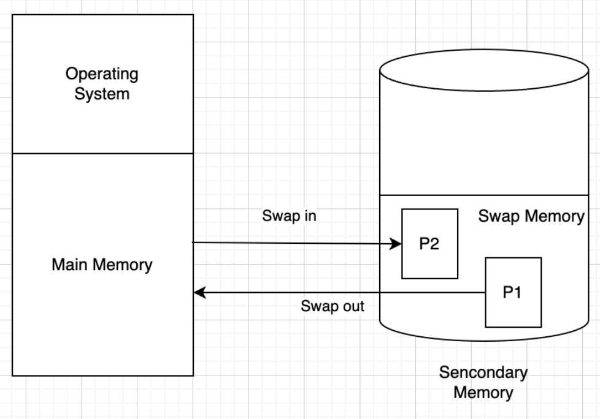

# Swap 메모리

### Swap 스페이스
물리적 메모리를 대체하는 하드 디스크의 공간이다.

### 특징

- Swapping: 실제 메모리와 가상 메모리간의 정보 교환을 말한다.
- 일부 디스크가 스와핑에 사용되는 공간으로 Secondary 메모리라 부른다.
- 가상 메모리는 실행중인 프로세스에서 사용하는 디스크 공간과 RAM의 조합이다.
- Swap 메모리는 하드 디스크에 있는 가상 메모리의 일부이다.
- RAM을 사용할 때 이 Swap 메모리를 사용할 수 있다.

### 용도
1. EC2와 같은 인스턴스 서버에서 메모리 공간보다 실행해야 하는 어플리케이션이 요구하는 메모리가 더 많이 필요로 할때 활용된다.
2. 오작동하는 프로세스가 RAM을 소진하여 Swap하는 경우가 발생 (보통은 오작동되는 프로세스를 해결해야 한다.)

## Swap 메모리란?

> 주 메모리 즉, RAM의 부족으로 인해 발생되는 문제를 해결하기 위해 사용되는 보조 메모리이다.

- RAM 공간이 부족한 상황에서 운영체제는 일부 데이터를 RAM에서 임시로 Swap 메모리로 옮겨놓는다.

- Swap 메모리는 하드 디스크의 일부를 할당하여 가상 메모리 공간으로 사용한다

- RAM 보다 느리지만 용량이 크기 때문에 필요에 따라 더 많은 데이터 저장 가능

- 즉, Swap 메모리는 RAM의 확장으로 간주할 수 있다.

### 용도

- 물리적 메모리 부족 보완
  - RAM이 모자라서 추가적인 데이터를 저장할 수 없을 때, 운영체제는 가장 오래 사용하지 않은 데이터나 프로세스를 Swap 메모리로 이동시켜 공간을 확보
- 메모리 압력 완화
  - 프로그램 실행도중 메모리 사용량이 갑작스럽게 증가할 경우, Swap 메모리를 활용하여 메모리 압력을 완화
- Hibernation
  - 현재 실행 중인 시스템 상태를 디스크에 저장하고 나중에 다시 불러올 수 있도록 한다. 이런 상태에서 Swap 메모리가 사용

