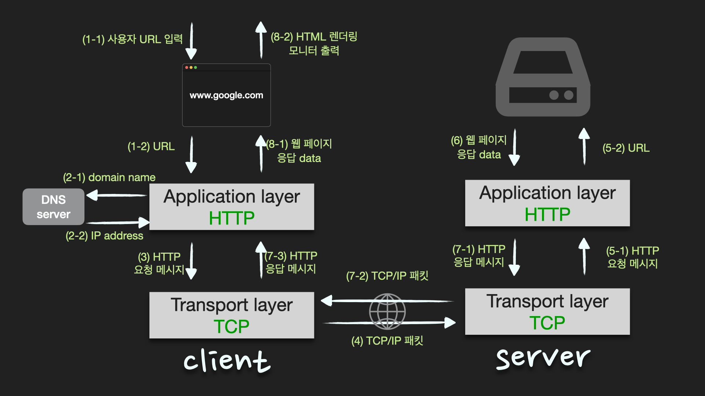

## 만약 google.co.kr에 접속하였을때 접속된 통신 과정에 대해

### 렌더링 순서는?

1. 사용자가 브라우저에 URL 입력
2. 브라우저는 DNS를 통해 서버의 IP 주소를 찾는다
3. client에서 HTTP request 메시지 ⇒ TCP/IP 패킷 생성 ⇒ server로 전송
4. server에서 HTTP requset에 대한 HTTP response 메시지 ⇒ TCP/IP 패킷 생성 ⇒ client로 전송
5. 도착한 HTTP response message는 웹 브라우저에 의해 출력(렌더링)

### 웹 동작 방식

1. 유저가 브라우저에서 www.google.co.kr(URL)을 입력을 하면 HTTP request message를 생성한다.
2. IP주소를 알아야 전송을 할 수 있으므로, DNS lookup을 통해 해당 domain의 server IP주소를 알아낸다.
3. 반환된 IP주소(구글의 server IP)로 HTTP 요청 메시지(request message) 전송 요청
   1. 생성된 HTTP 요청 메시지를 TCP/IP층에 전달
   2. HTTP 요청 메시지에 헤더를 추가해서 TCP/IP 패킷을 생성
4. 해당 패킷은 전기신호로 랜선을 통해 네트워크로 전송되고, 목적지 IP에 도달한다.
5. 구글 server에 도착한 패킷은 **unpacking**을 통해 message를 복원하고 server의 process로 보낸다.
6. server의 process는 HTTP 요청 메시지에 대한 response data를 가지고 HTTP 응답 메시지(response message)를 생성
7. HTTP 응답 메시지를 전달 받은 방식 그대로 client IP로 전송
8. HTTP response 메시지에 담긴 데이터를 토대로 웹브라우저에서 HTML 렌더링을 하여 모니터에 검색창이 보여진다.

