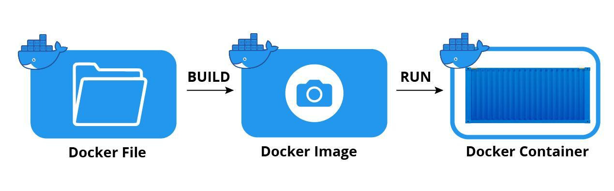

# Docker란?

Docker는 개발자가 컨테이너를 빌드, 배포, 실행, 업데이트 및 관리할 수 있는 오픈 소스 플랫폼입니다.
컨테이너는 애플리케이션 소스 코드와 모든 환경에서 해당 코드를 실행하는 데 필요한 운영 체제(OS) 라이브러리 및 종속성을 결합하는 표준화된 실행 가능한 구성 요소입니다.

## 컨테이너는?

컨테이너는 Linux 커널에 내장된 프로세스 격리 및 가상화 기능을 통해 작동합니다. 이러한 기능에는 프로세스 간에 리소스를 할당하기 위한 제어 그룹(Cgroup)과 시스템의 다른 리소스 또는 영역에 대한 프로세스의 액세스 또는 가시성을 제한하기 위한 네임스페이스가 포함됩니다.

이를 통해 여러 애플리케이션 구성 요소가 호스트 운영 체제의 단일 인스턴스 리소스를 공유할 수 있습니다. 이러한 공유는 하이퍼바이저를 통해 여러 가상 머신(VM)이 단일 하드웨어 서버의 중앙 처리 장치(CPU), 메모리 및 기타 리소스를 공유하는 것과 유사합니다.

컨테이너 기술은 애플리케이션 격리 및 비용 효율적인 확장성을 포함하여 가상 머신(VM)의 모든 기능과 이점과 함께 다음과 같은 기타 중요한 이점을 제공합니다.

- 경량화: VM과 달리 컨테이너는 전체 OS 인스턴스 및 하이퍼바이저의 페이로드를 전달하지 않습니다. 여기에는 코드를 실행하는 데 필요한 OS 프로세스 및 종속성만 포함됩니다. 컨테이너 크기는 메가바이트(일부 VM의 경우 기가바이트)로 측정되며, 하드웨어 용량을 더 잘 활용하고 시작 시간이 더 빠릅니다.

- 생산성 향상: 컨테이너화된 애플리케이션은 한 번 작성하면 어디서나 실행할 수 있습니다. VM에 비해 컨테이너는 배포, 프로비저닝 및 재시작이 더 빠르고 쉽습니다.

- 효율성 향상: 컨테이너를 사용하면 개발자는 동일한 하드웨어에서 VM을 사용할 때보다 몇 배나 많은 애플리케이션 사본을 실행할 수 있습니다. 이러한 효율성을 통해 클라우드 지출을 줄일 수 있습니다.
  컨테이너를 사용하는 조직은 향상된 애플리케이션 품질, 시장 변화에 대한 더 빠른 대응 등 다른 많은 이점을 보고합니다.

### Docker Image

Docker Image란 서비스 운영에 필요한 애플리케이션, 소스코드, 라이브러리, 실행파일, 설정 값들을 묶어서 가지고 있습니다. 즉, 애플리케이션을 행하기 위한 모든 요소를 포함하고 있는 것.
Docker 이미지들은 github과 똑같이 Docker Hub 사이트를 통해 버전관리 및 배포 Push, Pull이 가능합니다.

Docker Hub 사이트에서 다양한 컨테이너 이미지를 사용할 수 있는데, 여기서 Nginx 도커 이미지를 다운받고 실행시키면 Nginx가 바로 실행됩니다.

### DockerFile

도커 이미지를 만들기 위해서는 도커 파일이 필요합니다. 도커 파일을 이용해 이미지를 구성하기 위한 명령어들을 작성하여 이미지를 구성할 수 있습니다. 그리고 도커 파일은 이미지를 생성하기 위한 스크립트 파일입니다.
주로 텍스트 형식의 명령어들로 구성되어 있으며, 이를 사용하여 이미지 빌드 과정을 자동화하고 문서화할 수 있습니다.

### Docker Container

도커 컨테이너는 도커 이미지로 생성할 수 있으며, 도커 이미지와 컨테이너는 1 : N 관계를 갖고 있습니다.
즉, 하나의 이미지로 여러 컨테이너를 생성할 수 있습니다.

이미지를 실행하여 컨테이너를 생성하면, 도커 파일로 작성된 해당 이미지의 목적에 맞게 프로세스 단위의 격리 환경에 컨테이너가 생성됩니다.
