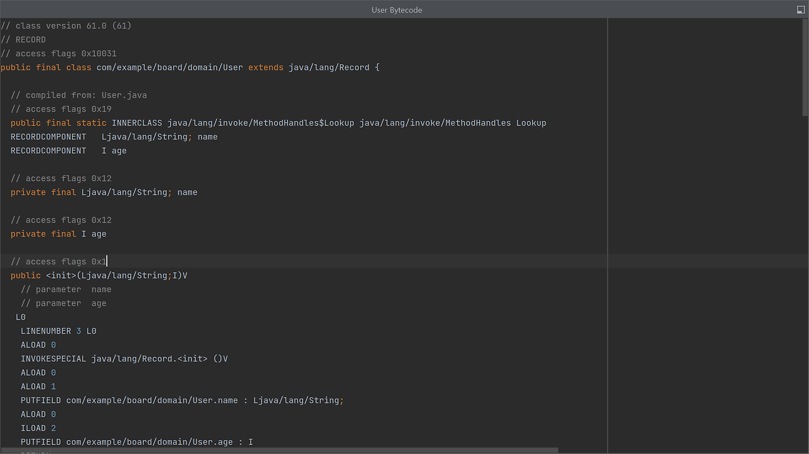

## 레코드(Record)란?
불변(immutable) 객체를 쉽게 생성할 수 있도록 하는 유형의 클래스이다.
JDK14에서 preview로 등장하여 JDK16에서 정식 스펙으로 포함되었습니다.

#### Record Before
학생(Student) 클래스에 이름과 나이 필드가 있다고 가정했을때,
Record를 사용하기 전, Student를 불변 객체를 생성하기 위해서는 다음과 같이 코드를 작성해야 합니다.

```java
public class Student {
	private String name;
	private int age;

	public Student(String name, int age) {
		this.name = name;
		this.age = age;
	}

	public String getName() {
		return name;
	}

	public int getAge() {
		return age;
	}
}
```

1. 모든 필드에 final 선언
2. 필드 값을 모두 포함한 생성자
3. 접근자 메서드(getter)
4. 클래스의 상속을 제한하려면 클래스 레벨에도 final 선언

벌써부터 귀찮아진다....

#### Record After
다음은 동일한 조건의 Student 객체를 record를 이용해 구현한 코드이다.

```java
public record Student(String name, int age) {
}
```

record를 사용하면 아래의 내용들을 직접 구현하지 않아도 자동으로 생성된다.

1. 필드 캡슐화
2. 생성자 메서드
3. getters 메서드
4. equals 메서드
5. hashcode 메서드
6. toString 메서드

이것이 가능한 이유는, 컴파일 타임에 컴파일러가 코드를 추가해주기 때문이다.
IntelliJ의 Bytecode Decompiler 기능을 이용하면 컴파일 된 바이트코드를 확인할 수 있다.



가장 먼저 class가 final로 선언되어 있는 것을 확인할 수 있다.
또한 name과 age 필드도 private final로 선언되어 있다.
`<init>(Ljava/lang/String;I)V` 는 JVM이 생성자로 인식하는 서명이다.
괄호 속 String;I는 해당 생성자가 String과 int 두 개의 매개변수를 받는 것임을 표시하고 있다.

커서를 더 내리다보면 toString(), hashCode(), equals() 메소드도 확인할 수 있다.
컴파일러가 이 메소드들을 컴파일 타임에 추가해준 덕에, 직접 작성하지 않은 메소드들을 바이트 코드에서 확인할 수 있다. (심지어 final이니 불변성이 보장되어 있다.)

기존 Class와 차이점이 있다면 getter를 사용할 때, getFieldName()이 아니라 fieldName()을 사용한다는 점이다.

```java
Student student = new Student("kim", 20);
System.out.println(student.getName()); //일반 Class
System.out.println(student.name()); //Record Class
```
 
기본적으로 Record 클래스가 제공해주는 메소드들은 재정의가 가능하다.
다음은 생성자를 재정의해서 사용하는 예시이다.

```java
public record Student(String name, int age) {
    public Student {
        if(age < 0) {
            throw new IllegalArgumentException("Age cannot be negative");
        }
    }
}
```

### Q. 레코드(record)를 JPA의 Entity 클래스로 사용할 수 없을까요?
우리가 Entity 선언 가능한 조건을 알게된다면 사용할 수 없는 이유에 대해 알 수 있을 것이다.
우선 레코드는 바이트코드로 본 것처럼 final 클래스(상속불가)이고, abstract로 선언할 수 없다.
따라서 레코드를 Entity 클래스에 사용할 수 없는데, 그 이유는 JPA의 지연로딩에 있다.

지연 로딩 방식을 사용할 때, JPA는 엔티티 객체의 프록시 객체를 생성하고, 프록시 객체는 원본 객체를 상속하여 생성된 확장 클래스이다. 하지만 레코드는 상속이 불가능하므로 엔티티로 사용할 수 없다.