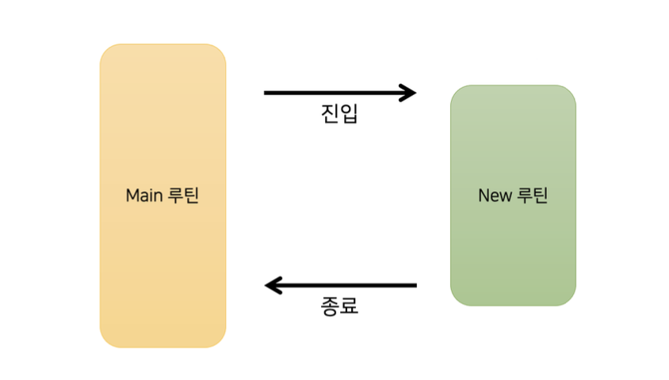
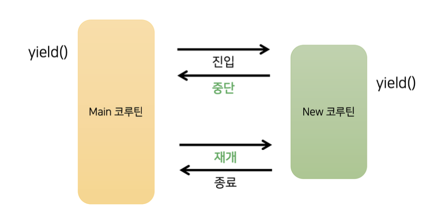

# 코루틴이란?
코루틴, 영어로 하면 Co-Routine이다.
Co는 협력, Routine은 간단히 함수라고 표현할 수 있다.
협력하는 함수라는 뜻으로, 프로그래밍에서 함수도 서로의 호출과 반환을 주고 받으며 협력을 한다.
```kotlin
fun main() {
    println("START")
    newRoutine()
    println("END")
}

fun newRoutine() {
    val num1 = 1
    val num2 = 2
    println("${num1 + num2}")
}
```

굉장히 직관적인 이 코드는 2개의 Routine, 함수가 있다.
```
## 출력값
START
3
END
```

이와 같은 출력값은
1. main 루틴이 START 출력 이후 new 루틴 호출
2. new 루틴이 1,2를 더해 출력
3. 그 이후 newRoutine()이 종료되고 main 루틴으로
4. main 루틴은 END를 출력하고 종료



이때 메모리 관점으로 newRoutine이 종료된 이후 새로운 루틴이 호출되면 지역변수 num1, num2에는 초기화가 되어 다시 접근할 수 없게 되고, 따라서 메모리에서도 정보가 사라진다.

루틴을 사용해보는 코드를 살펴보았으니 이번엔 코루틴 의존성을 추가할 것이다.
```
dependencies {
    implementation("org.jetbrains.kotlinx:kotlinx-coroutines-core:1.7.2")
}
```

이와 같이 의존성을 추가하고

```kotlin
fun main(): Unit = runBlocking {
    println("START")
    launch {
        newRoutine()
    }
    yield()
    println("END")
}
suspend fun newRoutine() {
    val num1 = 1
    val num2 = 2
    yield()
    println("${num1 + num2}")
}
```
여기서 가장 먼저 보이는 함수는 runBlocking이다.
`runBlocking` 함수는 일반 루틴 세계와 코루틴 세계를 연결하는 함수이다.
다음으로 `lanuch` 라는 함수도 보이는데, 반환값이 없는 새로운 코루틴을 만드는 데에 사용된다.

현재, runBlocking()과 launch()를 사용해 2개의 코루틴을 만들었다.
다음으로 yield()라는 함수가 보이는데 yield라는 단어는 `양보하다`라는 사전적 의미가 있는데, 말 그대로 코루틴의 실행을 잠시 멈추고 다른 코루틴이 실행되도록 양보하는 루틴이다.

마지막 `suspend fun`이라는 키워드가 보이는데, 코틀린에서는 일반적인 함수 선언을 fun으로 하는 것과 다르게 suspend 키워드를 붙여 suspend fun이라는 중단 함수 선언을 하였다.

```
START
END
3
```
선언 후 실행결과가 달라졌다.
yield() 때문에 양보해서 3의 결과값이 뒤로 밀린걸까 하지만 yield를 지우더라도 똑같다.

출력이 나오는 과정을 보면
1. main 코루틴이 runBlocking에 의해 시작되고 START가 출력된다.
2. launch에 의해 새로운 코루틴이 생긴다. 하지만, newRoutine의 실행은 바로 일어나지 않는다.
3. main 코루틴 안에 있는 yield()가 되면 main 코루틴은 new 코루틴에게 실행을 양호한다.
즉, launch가 만든 새로운 코루틴이 실행되고, newRoutine 함수가 실행된다.
4. newRoutine 함수는 다시 yield()를 호출하고 main 코루틴으로 되돌아온다.
5. main 루틴은 END를 출력하고 종료된다.
6. 아직 newRoutine 함수가 끝나지 않았으니 newRoutine 함수로 되돌아가 3이 출력되고 프로그램이 종료된다.



과정을 도식화 해보면 이와 같다.
일반적인 루틴과 코루틴의 가장 큰 차이는 중단과 재개이다. 루틴은 한 번 시작되면 종료될때까지 멈추지 않지만, 코루틴은 상황에 따라 잠시 중단되었다가 다시 시작하기도 한다.
완전히 종료되기 전까지는 newRoutine 함수 안에 있는 num1, num2 변수가 메모리에서 제거되지도 않는다.

이번에 루틴과 코루틴의 차이에 대해 살펴보았다.
코루틴의 핵심은 중간에서 멈춰! 하다가 다시 시작할 수 있는 특징이 핵심이고 다음엔 '스레드'와의 차이를 알아볼 것이다.

TMI ) 앞 사람 엠스톤 저소음 밀키축 사용하는데 나도 갖고 싶어졌다...

---
### 참고
- 2시간으로 끝내는 코루틴 - 인프런 강의