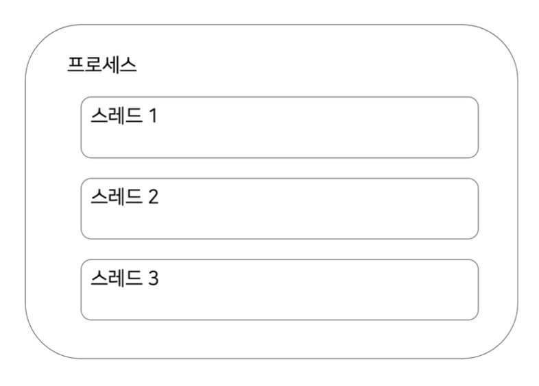
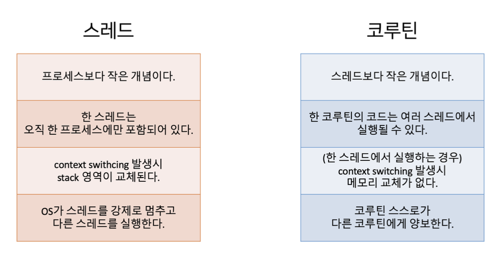

# 스레드와 코루틴

우선 간단히 프로세스부터 스레드까지 알아보자.

### 프로세스
프로세스는 컴퓨터에서 실행되고 있는 프로그램

### 스레드
프로세스보다 작은 개념으로, 프로세스 내에 있는 여러 코드들의 작은 실행단위이다.

보통 멀티스레드 환경은 한 프로세스 내에 여러 스레드를 가진다.

여기서 간단히 정리해보면, 스레드는 프로세스가 있어야 하고, 스레드는 코드를 실행하며 스레드가 프로세스보다 작은 개념이다.
코루틴은 단지 우리가 작성한 루틴으로, 코드의 종류 중 하나이기 때문에 코루틴 코드 가 실행되려면 스레드가 있어야만 한다. 그런데 코루틴은 중단되었다가 재개될 수 있기 때문 에, 코루틴 코드의 앞부분은 1번 스레드에 배정되고, 뒷부분은 2번 스레드에 배정될 수 있다.

여기서 코루틴은 스레드보다 작은 개념이기에 **프로세스 > 스레드 > 코루틴**으로 크기가 비교된다.

---
프로세스 내에 스레드는 독립적으로 가져가기에 특정 스레드가 다른 특정 프로세스에 옮겨갈 수는 없다.
코루틴 같은 경우는 코루틴이 직접 코드를 실행시키는 개념이 아니라 코루틴이 가지고 있는 코드를 스레드에 넘겨 실행하는 방식이다.

일단 코루틴이라는 존재는 중단과 재개가 가능한 루틴이다.
특정 코루틴 내에 코드1,2가 존재한다고 가정하자.

두 개의 스레드1,2가 존재하면 코루틴 내에 코드1이 시작되고 스레드1에서 실행된다.
코루틴 내에 코드1이 끝나고 중단되는 지점이 있다면, 코드2가 스레드2에서 실행할 수 있도록 스레드 할당이 가능하다.

---
그리고 코루틴과 스레드는 **Context Switching(문맥 교환)**에서도 차이가 발생된다.

우선 프로세스의 Context Switching이 일어난다면 각각의 프로세스는 완전히 독립된 메모리를 가지고 있기 때문에, CPU 코어에서 특정 프로세스를 가져가 실행시킬때 프로세스1의 메모리를 사용한다. 여기서 Switching이 발생된다면 두 번째 프로세스 메모리로 완전히 갈아끼워야 한다.

그래서 메모리 비용이 크게 발생되는데, 스레드는 좀 다르다.
일단 스레드는 프로세스내에 독립적으로 움직이는 걸 알아보았다.
스레드는 스택 영역을 가지고 있다. 힙 내에서 스택 공유가 자유롭다.
os로 인해 스레드1이 중단되고 스레드2로 갈아끼울 때 힙 영역은 그대로 두고 스택만 갈아끼우면 되는 것이다.
즉, 스레드는 힙 메모리 영역을 공유하고, 스택만 교체되기에 Context Switching 비용이 적게 든다.

코루틴은 아까 작성했던 내용처럼 중단되었다가 재개되는 게 포인트이다.    
멈췄다가 다른 코루틴이 실행되고 한 스레드에서 여러 코루틴이 실행된다.
한 스레드에서 코루틴1이 코드1,2를 가지고, 코루틴2가 코드3을 가지고 있다 가정하자.
코루틴1의 코드1이 스레드에서 실행되었다가 중단 지점이후 코루틴2의 코드3을 실행하도록 양보(yield)하고, 코루틴 코드2를 스레드에 실행되도록 할 수 있다.
여기서 스레드 교환이 아닌 코루틴의 중단과 재개를 활용하여 메모리 전체를 공유하기에 Context Switching 비용이 스레드보다 적게 든다.

- 이렇게 양보하는 행위를 비선점형이라고도 한다.
- 스레드처럼 어떤 다른 존재에 의해 직접적으로 개입되서 자리가 비켜지는 걸 선점형이라 한다.

여기서 코루틴의 장점이 보일 수 있는 점으로 **동시성 확보**가 가능하다.

