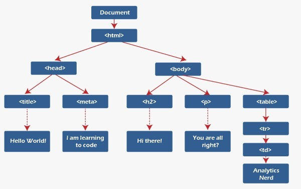
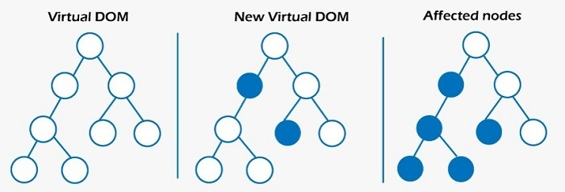

# DOM과 가상 DOM

## 1. DOM
웹 사이트에 접속하면 보이는 각각의 Element들이 하나로 모여 문서를 구성한다.
문서의 구조를 프로그래밍 언어가 이해할 수 있도록 표현한 것이 DOM의 정의이다.

DOM은 요소들을 위 그림처럼 트리 형태로 표현하며, 각 요소에 해당되는 노드가 존재한다.
개발자들은 DOM이 제공하는 API를 이용해 DOM 구조에 접근하고, 내용이나 스타일(CSS) 또한 변경이 가능하다. 이러한 행위를 DOM 조작이라 한다.

하지만 예를 들어, 웹 페이지의 특정 요소의 색상을 변경하려면, 해당 요소를 찾고 색상을 변경한 후, 그 변경 사항을 적용하기 위해 해당 요소부터 하위 요소까지 브라우저가 화면을 다시 그리는데 많은 비용이 발생된다.

즉, 리플로우(Reflow) 및 리페인트(Repaint)에 대한 비용이 많이 발생하게 되는 것이다.
- 리플로우(Reflow): DOM의 구조나 레이아웃이 변경되면 브라우저는 새로운 레이아웃을 계산하고 화면을 다시 그린다. 이를 리플로우라고 합니다. 예를 들어, 요소의 크기나 위치를 변경하면 리플로우가 발생된다.
- 리페인트(Repaint): 요소의 색상이나 테두리 등 외양이 변경되면, 브라우저는 해당 요소를 다시 그리며. 이를 리페인트라고 한다.

## 1.1. DOM Fragment
DOM Fragment와 가상돔(Virtual DOM)은 모두 리플로우와 리페인트를 최소화시켜서 성능을 향상시키는 목표는 같은데 가상 돔이 DOM Fragment를 더 발전시킨 개념이라고 볼 수 있고, 가상돔은 추상화된 복사본을 메모리에 유지하고 이를 통해서 변경사항을 적용시킨다는 차이가 있다. DOM Fragment는 createDocumentFragment() 메서드를 사용해서 DOM Fragmen의 여러 개의 자식 노드로 추가하고 이렇게 추가된 DOM Fragment를 실제 돔에 추가한다.

## 2. 가상 DOM (Virtual)
DOM Fragment의 문제를 해결한 것이 가상 DOM이다.
React는 렌더링이 발생될 상황에 놓이면 새로운 화면에 들어갈 내용이 담긴 가상 돔을 생성한다.
가상돔이란 **실제 DOM의 가벼운 복사본으로 메모리 상에 존재하며, Javascript의 객체 형태로 존재한다.**
React는 항상 렌더링 이전의 화면 구조와 렌더링 이후의 화면 구조를 가진 두 개의 가상 돔 객체를 유지하고 있으며 비교하면서 변경된 부분만 실제 DOM에 반영한다.

## 2.1 가상 DOM의 동작 원리

가상 돔의 비교 과정에서는 diffing 알고리즘이 사용된다.이 알고리즘은 두 가상 돔 트리를 효율적으로 비교하여 어떤 요소가 변경되었는지를 정확히 파악한다.
 
####  diffing 알고리즘 동작 방식

- 이전 가상돔 트리와 새로운 가상돔 트리를 비교하고 루트 노드에서 시작해서 이전과 새로운 노드를 비교한다.
- 두 노드가 다른 유형이면 새 노드를 생성하여 기존 노드를 대체한다.
- 근데 두 노드가 같은 유형이면 속성을 비교해서 변경된 것이 있는지 확인하고 변경된 속성이 없으면 그대로 사용하고 있으면 속성을 업데이트한다.
- 이렇게 해서 자식노드를 재귀적으로 비교한다.

이 과정을 '재조정(reconciliation)'이라고 부르는데, 재조정을 통해 변경 사항이 파악되면, 해당 변경 사항만 실제 DOM에 반영하여 업데이트한다.

이런 방식으로 전체 DOM 트리를 재구축하지 않고, 필요한 부분만 빠르게 업데이트할 수 있다.
더 나아가, 리액트는 여러 상태 업데이트를 한 번에 수행하는 Batch Update 메커니즘을 통해 더욱 효율적인 렌더링을 가능하게 한다.

이렇게 가상 돔은 실제 DOM을 직접 조작하는 대신 간접적으로 조작하면서 렌더링 성능을 향상시키는 역할을 한다.

